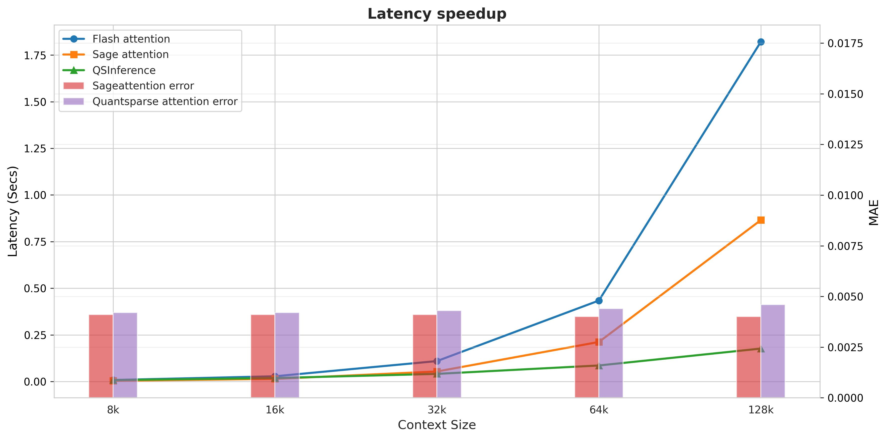

# QSInference: Quantized sparse attention for long context LLMs
QSInference exploits the intrinsic dynamic sparsity of LLM attention while leveraging its head-specific structural regularities to accelerate long-context prefill. An offline profiling stage assigns each attention head to a canonical sparse topology. At runtime, the system performs online approximation of the active sparse indices and executes attention using head-specialized, block-aware custom kernels. Furthermore, the pipeline integrates 8-bit quantization for both attention operands and intermediate buffers, minimizing memory bandwidth, improving cache locality, and maximizing throughput on modern accelerator architectures.

---
## Performance

---
## Usage
### Base environment

python>=3.10.12 , torch>=2.7.0 , triton>=3.5.1, CUDA>-12.6

### API
```
from QSInference.core import quant_sparse_causal_attn
attn_output = quant_sparse_causal_attn(q, k, v, top_k)
```

> q, k, v are FP16/BF16 dtype with the shape (batch_size, head_num, seq_len, head_dim) 

> top_k: number of highest-scoring tokens each query attends to, controls sparsity: smaller k = more sparse = faster but less context

---
## Acknowledgement
+ [FlashAttention](https://github.com/Dao-AILab/flash-attention)
+ [StreamingLLM](https://arxiv.org/abs/2309.17453)
+ [Duo Attention](https://github.com/mit-han-lab/duo-attention)
+ [MInference 1.0](https://arxiv.org/abs/2407.02490)
+ [Sageattention](https://arxiv.org/abs/2410.02367)

